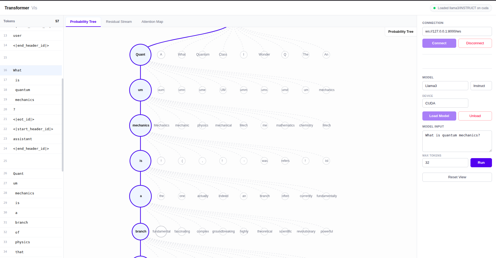
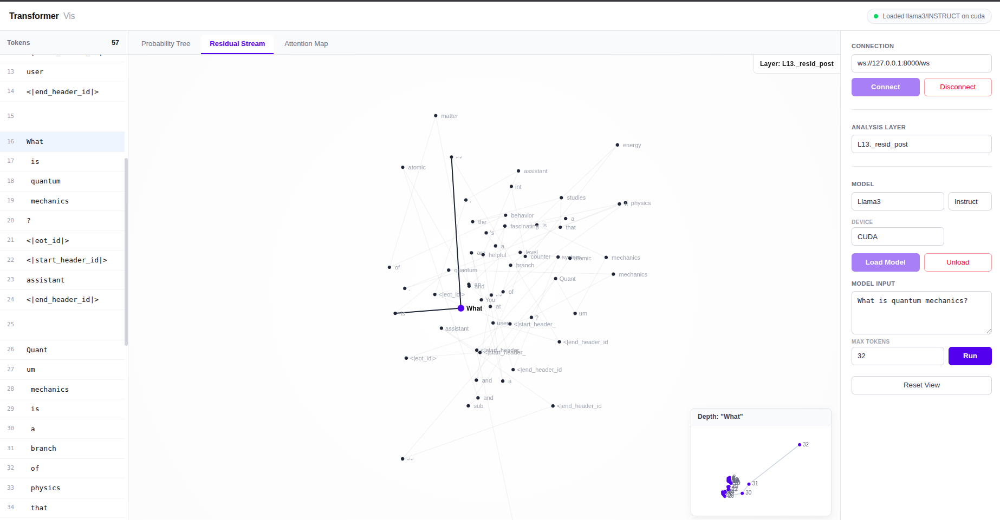
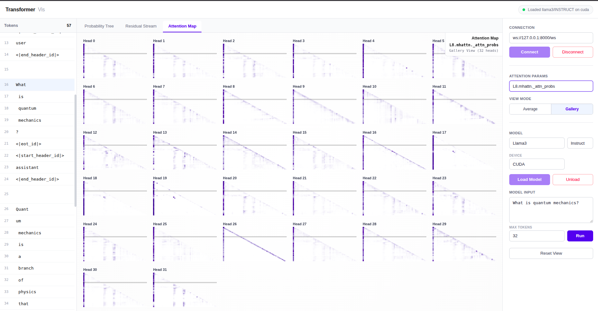

# minimal pytorch text gen playground

decoder-only llm toybox in pytorch with gpt-2, llama 3, gemma 3, and qwen 3. a scrappy pet project to sample text fast and peek inside what the model is thinking.

## highlights
- kv-cached streaming generation for interactive decoding
- safetensors weight streaming that materializes layers on meta and fills them on cpu/gpu
- optional weight-only int8 paths (naive and torchao) you can toggle at load time
- device-aware dtype defaults plus simple hooks for inspecting residuals and attention

## quickstart
- generate text: `python generate.py --model llama3 --type base --prompt "life is"` (swap model/type/prompt as you like)
- visualize behavior: run the app, tweak settings, and watch probability trees, residual pca in 3d, and attention heads in real time
- server workflow: start the fastapi websocket server, point a client at `/ws`, and stream token-by-token payloads you can render in your own ui

## commands
run a one-off decode
```bash
python generate.py --model llama3 --type base --prompt "life is"
```

start the websocket server (for streaming tokens + internals)
```bash
uvicorn server:app --host 0.0.0.0 --port 8000
```

serve the static frontend (simple local file host)
```bash
cd frontend
python -m http.server 8080
```
open http://localhost:8080 in your browser and point it at the websocket endpoint (default ws://localhost:8000/ws).

## what you can explore
- decoding choices: track how next-token probabilities shift as context grows
- residual trajectories: see residual stream snapshots projected to 3d (pca) to understand representation drift
- attention patterns: browse head heatmaps to spot attention sinks, induction heads, and long-range links
- controls: switch models, set prompt/length, and toggle which internals to emit without changing code

## visuals (sample views)

### probability tree over logits

branched view of next-token candidates; circle size tracks probability mass, so you can see where the decoder is leaning at each step. follow the highlighted path to understand which tokens the sampling scheme actually took versus strong-but-rejected alternatives. great for spotting uncertainty, mode switches, and how earlier context shifts the distribution.

### residual stream pca in 3d

embedding matrix is projected with pca to define a 3d basis; every generated token’s residual state is then projected into that space for each layer/position. you can watch the trajectory the model walks through representation space—how early tokens cluster, how later layers steer, and where the path bends when attention or mlp blocks inject new signal. useful for comparing how prompts or decoding settings alter the shape of the walk.

### attention heads heatmaps

per-layer head activations laid out as heatmaps so you can spot attention sinks, induction heads, copy behavior, and other specialty patterns. look for diagonal traces (copy), repeated off-diagonal bands (induction), and saturated columns (sinks). pairs well with the probability tree to explain why a token was chosen and with residual tracks to see how heads steer the representation.
